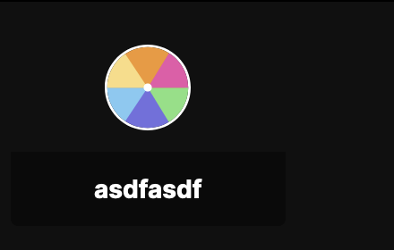

# Getting Started

So, you want to build a Truffle App.&#x20;

You'll need to do a few things to get started

* Install the [Truffle Browser Extension](https://truffle.vip/extension)
* Install the [Truffle CLI](https://github.com/trufflehq/truffle-cli#installing)

## Installing the Extension

Download the extension at [https://truffle.vip/extension](https://truffle.vip/extension). Firefox or any chromium browser (chrome, edge, opera, brave, etc) should work, although only Chrome and Firefox are officially supported.

## Installing the Truffle CLI

To create an app, you'll need to download the Truffle CLI. The Truffle CLI is only officially supported on \*nix platforms (i.e. Linux and macOS), so if you're on Windows, you'll need to use WSL. Here are some Microsoft docs on how to get started with that. [https://learn.microsoft.com/en-us/windows/wsl/install](https://learn.microsoft.com/en-us/windows/wsl/install)&#x20;

The Truffle CLI is an npm package, so you'll need npm or a compatible package manager like yarn to get started.

npm: [https://docs.npmjs.com/downloading-and-installing-node-js-and-npm](https://docs.npmjs.com/downloading-and-installing-node-js-and-npm) \
yarn: [https://yarnpkg.com/getting-started/install](https://yarnpkg.com/getting-started/install)&#x20;

Install the CLI globally with:



```bash
npm install -g @trufflehq/cli
```



```bash
yarn global add @trufflehq/cli
```



if you previously installed the CLI, make sure `truffle-cli --version` is 0.6.0 or higher.

## Setting up the CLI

Once you have the CLI installed, you'll need to log into it and point it to your creator org. An org is simply an entity that creators use to associate with their followers. Even if you're not a creator, you'll still use an org to house your app.

First, if you don't have a truffle account already, create one with the cli

```bash
truffle-cli user create
```

If you already have an account, you can log into it with

```bash
truffle-cli login
```

Next, you'll need to configure the CLI to use your creator org. If you haven't created one yet, do so with

```
truffle-cli org create "<your-new-org-name>"
```

If you already have an org, "use" it with

```
truffle-cli org use <your-org-slug>
```

## Create a Truffle App

Before we start, let's create a new directory for our app

```
mkdir truffle-app
```

Then create a new Truffle app like so

```
truffle-cli app create my-truffle-app
```

This command will create a new Truffle App in the org that you are currently using with the slug "my-truffle-app". It will then write a base configuration file called `truffle.config.mjs`. Open up `truffle.config.mjs` and you should see the following contents:

```typescript
export default {
  path: "@my-org/my-truffle-app",
  name: "my-truffle-app",
  cliVersion: "0.6.0"
};
```

In order to test this later, we'll need to deploy our app and then install it to our org. Deploy it with

```
truffle-cli app deploy
```

Then install it to your org with

```
truffle-cli app install @my-org/my-truffle-app
```


When you run `truffle-cli install`, it will install the app into your current org, i.e. the one you set with `truffle-cli org use`. If you want to double-check which org you're using, run `truffle-cli whoami`.


Great! You've finished up setting up a Truffle App. Now let's create a web app to go with it!

## Creating a Truffle Embed

My favorite way of creating a web app is with [Vite](https://vitejs.dev/). In this tutorial, we're going to use React. Create a new project with



<pre class="language-bash"><code class="lang-bash"><strong>npm create vite@latest .
</strong></code></pre>



```bash
yarn create vite .
```



Then of course, make sure all dependencies are installed.



```bash
npm install
```



```bash
yarn
```



Now let's run the application.&#x20;



```bash
npm run dev
```



```bash
yarn dev
```



That should spin up a server at [http://localhost:5173](http://localhost:5173). The port could be different, depending on your machine.

Before we go any further, let's make sure we get signed in to your Truffle account in the browser. You can do so at [https://app.truffle.vip/login](https://app.truffle.vip/login).

<figure><figcaption><p>The Truffle login page</p></figcaption></figure>

Then head over to [https://app.truffle.vip/dev/embed](https://app.truffle.vip/dev/embed). This is where we'll test our web app. Paste the url for your dev server (e.g. [http://localhost:5173](http://localhost:5173)) into the URL field in the left pane and select "Set URL". Your web app should appear to the right. Then select your org and app at the bottom of the left pane.

<figure><figcaption><p>A web app loaded into Truffle's Embed test viewer</p></figcaption></figure>

Great! Now that we've got our testing environment set up, let's start building our application.

Kill the server and run the following command to install the Truffle SDK.



```bash
npm install @trufflehq/sdk
```



```bash
yarn add @trufflehq/sdk
```



Now go to the `src/main.tsx` file. Replace it with the following contents:

```tsx
// src/main.tsx

import React, { useEffect, useState } from "react";
import ReactDOM from "react-dom/client";
import App from "./App.tsx";
import "./index.css";

// import `subscribeToAuth` from the Truffle SDK
import { subscribeToAuth } from "@trufflehq/sdk";

const Main = () => {
  // create a state variable to track if the user is authenticated
  const [isAuthenticated, setIsAuthenticated] = useState(false);

  // on the initial render, set up a listener for
  // the user's authentication state
  useEffect(
    () => {
      subscribeToAuth((truffleApp) => {
        // when the authentication state changes,
        // set the authentication state variable
        setIsAuthenticated(truffleApp.mtClient.isAuthenticated);
      });
    },

    // pass an empty dependency array so that this hook only runs once
    []
  );

  return (
    <>
      {isAuthenticated ? (
        // if the user is authenticated, render the app
        <App />
      ) : (
        // otherwise, render a message telling the
        // user that they aren't logged in
        <div>You're not logged in!</div>
      )}
    </>
  );
};

ReactDOM.createRoot(document.getElementById("root")!).render(
  <React.StrictMode>
    <Main />
  </React.StrictMode>
);
```

This code snippet imports the `subscribeToAuth` function from the Truffle SDK and uses it to conditionally render our app based on whether or not the user is signed into Truffle.

Now let's update our app to get some info about the user. Truffle's backend api is called **Mothertree**, so naturally, there is a class `MothertreeClient` in the SDK. You can get an instance of the MothertreeClient that is authenticated with the user's credentials by calling `getMtClient()` from the SDK. Since we're building a React app, we'll make a hook that does that for us.

```typescript
// src/hooks/use-mt-client.ts

import { getMtClient } from "@trufflehq/sdk";
import { useMemo } from "react";

export function useMtClient() {
  return useMemo(() => getMtClient(), []);
}
```

Now let's update `App.tsx` to show the user's name.

```tsx
// src/App.tsx

import { useEffect, useState } from "react";
import { useMtClient } from "./hooks/use-mt-client";
import "./App.css";

function App() {
  // create a state variable for the user's username
  const [userName, setUserName] = useState("");

  // get an instance of the MothertreeClient from the hook
  // that we created earlier
  const mtClient = useMtClient();

  // on initial load of the component, query the user's info
  useEffect(() => {
    mtClient.getOrgMember().then((orgMember) => {
      // set the userName state variable to the user's name
      setUserName(orgMember.name);
    });
  }, []);

  return (
    <h1>Hello, {userName}</h1>
  );
}

export default App;
```

Technically, we're not grabbing the user's information, but rather the `OrgMember`'s information. An `OrgMember` is a data model that represents a user's subscription to a particular org. This allows the user to have different profiles for each org that they're a member of.

After modifying `App.tsx`, the app should look something like this:

<figure><figcaption><p>A basic react app showing the signed in Truffle user's username</p></figcaption></figure>

Congrats! You've made your first Truffle Embed. However, we've only gotten it to display in the dev viewer... in the next Tutorial, I'll show you how to modify your Truffle App config to make the embed show up on your live stream.
