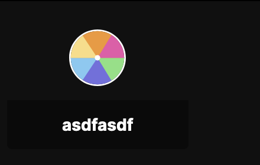

# Getting Started

In this tutorial, we'll be creating what we call an **embed**. Embeds are simply iframes that get rendered on top of Youtube videos and live streams. All you need is the url of an app or site.

## Setting Up a Basic Embed

First, make sure you have the truffle.tv extension installed by heading over to [https://truffle.vip/extension](https://truffle.vip/extension).

Go to any Youtube video or stream and open up the dev tools by right-clicking and clicking "inspect", or by hitting the `F12` key on your keyboard.

Navigate to the "Console" tab, paste the following into the input, and press enter:

```javascript
localStorage.setItem(
  "truffle:devExtensionMappings",
  JSON.stringify([
    {
      iframeUrl: "<SITE_URL>",
      domAction: null,
      defaultLayoutConfigSteps: [
        { action: "querySelector", value: "body" },
        { action: "appendSubject", value: null },
        { action: "useSubject", value: null },
        {
          action: "setStyle",
          value: {
            position: "fixed",
            width: "600px",
            height: "600px",
            top: "100px",
            left: "100px",
            "z-index": 1000,
          },
        },
      ],
    },
  ])
);
```


We're working on a less janky way of adding dev embeds... sit tight and we'll update the docs as soon as we've built it :p


Then refresh the page and you should see your shiny new embed show up on the page!

<figure><figcaption><p>Your first embed!!!</p></figcaption></figure>

Congrats! You've created your first embed. But that's not all... we have more to offer you.

## Manipulating the Embed

If you simply want to embed a static page into a Youtube video or live stream page, then following the above instructions may be enough for you. If you want to go one step further, you can use the **truffle javacript SDK** to dynamically control the appearance of the embed from within your site.

### Examples

If you're ready to jump in and read some code, check out our [examples](https://github.com/trufflehq/truffle-packages/tree/0b7189daa625ac339e872fea19020ee26eb1c266/npm/sdk/examples).

### Installing the SDK

If you're using a frontend framework like [React](../reference/mycelium-api/models/economyaction/) or [Vue](https://vuejs.org/), you can simply run npm install.

```shell
npm install @trufflehq/sdk
```

Or if you're a yarn user

```shell
yarn add @trufflehq/sdk
```

Then import the embed object like so:

```javascript
import { embed } from '@trufflehq/sdk'
```

If you're not using a framework or a module bundler, you can simply import it as a module directly in a script.

```html
<script type="module">
   import { embed } from 'https://npm.tfl.dev/@trufflehq/sdk'
   
   // ...
</script>
```

### Using the SDK

Now that you have the SDK imported, you can manipulate the embed.

You can set the size using css units.

```javascript
embed.setSize("500px", "500px")
```

You can set the position (also using css units).

```javascript
embed.setPosition("25%", "25%")
```

You can also set the visibility.

```javascript
embed.hide()
embed.show()
embed.setVisibility(true)
```

If none of those methods satisfy your needs, you can set custom css styles on the iframe.

```javascript
embed.setStyles({
  border: "5px solid red"
})
```

You can also clear the styles on the iframe.

```javascript
embed.resetStyles()
```

With that, you should have enough flexibility to build some pretty cool shit with the truffle.tv extension!
